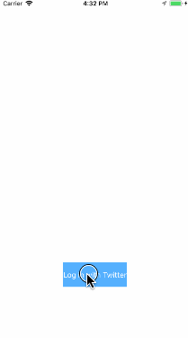

# Project 3 - *Twitter*

**Twitter** is a basic twitter app to read and compose tweets from the [Twitter API](https://apps.twitter.com/).

Time spent: **22** hours spent in total

## User Stories

The following **required** functionality is completed:

- [x] User can sign in using OAuth login flow.
- [x] User can view last 20 tweets from their home timeline.
- [x] The current signed in user will be persisted across restarts.
- [x] In the home timeline, user can view tweet with the user profile picture, username, tweet text, and timestamp.  In other words, design the custom cell with the proper Auto Layout settings.  You will also need to augment the model classes.
- [x] User can pull to refresh.
- [x] User can compose a new tweet by tapping on a compose button.
- [x] User can tap on a tweet to view it, with controls to retweet, favorite, and reply.

The following **optional** features are implemented:

- [x] When composing, you should have a countdown in the upper right for the tweet limit.
- [x] After creating a new tweet, a user should be able to view it in the timeline immediately without refetching the timeline from the network.
- [x] Retweeting and favoriting should increment the retweet and favorite count.
- [x] User should be able to unretweet and unfavorite and should decrement the retweet and favorite count.
- [x] Replies should be prefixed with the username and the reply_id should be set when posting the tweet,
- [x] User can load more tweets once they reach the bottom of the feed using infinite loading similar to the actual Twitter client.

The following **additional** features are implemented:

- [x] The countdown is implemented as a text label within a UIToolbar. The toolbar is set as the input accessory view of the text view which shows above the keyboard.
- [x] The countdown becomes red if it's negative meaning number of chars excceding limit and the tweet button is disabled.
- [x] Pop up alert when there is an error.
- [x] Delay dispatch loading more tweets to decrease the chance of getting 429 error.

Please list two areas of the assignment you'd like to **discuss further with your peers** during the next class (examples include better ways to implement something, how to extend your app in certain ways, etc):

1. what is the best to way to pass delegate object to destination controller. Say we have vc1->vc2->vc3, I want to assign vc1 to vc3.delegate. Currently, I hold a delegate property in vc2 which is assigned in v1's preparesegue. Then I use this to pass to vc3 in vc2's preparesegue
2. how to animate the progress indicator in the bottom of the table like how the refresh control does: show from part of the indicator to full indicator as you pull up the table view

## Video Walkthrough

Here's a walkthrough of implemented user stories:

GIF created with [LiceCap](http://www.cockos.com/licecap/).

## Notes

Haven't figured out how to animate the loading more indicator perfectly. I want to show from part of the indicator to full indicator depending on how much the user pull up the table view

## License

    Copyright [2017] [Xiang Yu]

    Licensed under the Apache License, Version 2.0 (the "License");
    you may not use this file except in compliance with the License.
    You may obtain a copy of the License at

        http://www.apache.org/licenses/LICENSE-2.0

    Unless required by applicable law or agreed to in writing, software
    distributed under the License is distributed on an "AS IS" BASIS,
    WITHOUT WARRANTIES OR CONDITIONS OF ANY KIND, either express or implied.
    See the License for the specific language governing permissions and
    limitations under the License.
